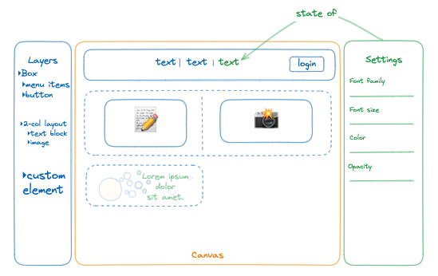
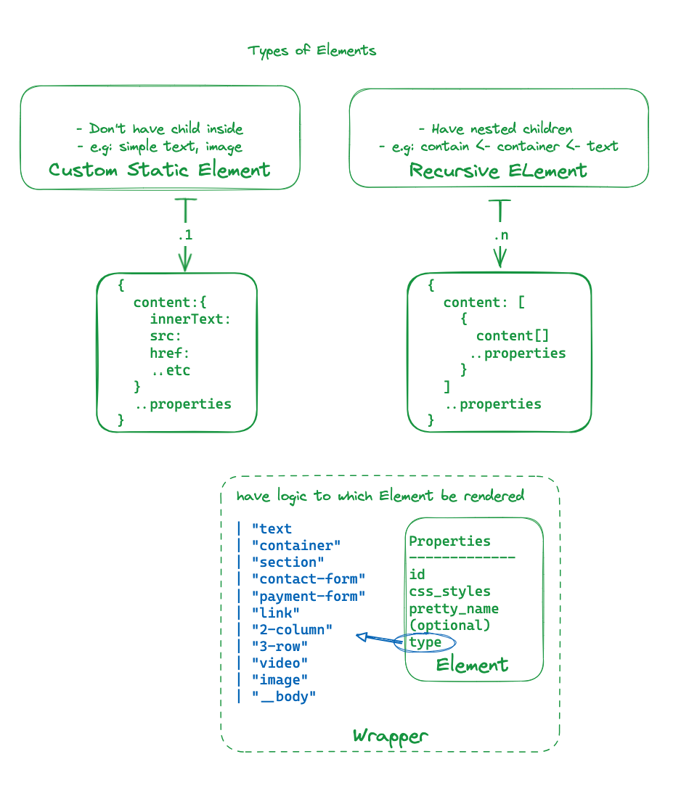
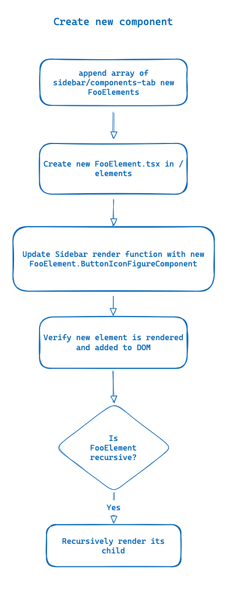
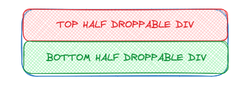
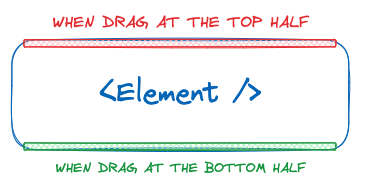

## Introduction

In today's digital landscape, the demand for dynamic and interactive web experiences is higher than ever. However, not everyone possesses the technical expertise or resources to design and develop a website from scratch.

In this tutorial, we'll embark on an exciting journey to create an exceptional drag-n-drop to build a website using cutting-edge technologies: Next.js 14, TailwindCSS, and @dnd-kit/core. By the end of this guide, you'll not only have a deep understanding of these powerful tools but also be able to craft multiple customizable websites

**Why Drag-n-Drop?**
The ability to drag and drop elements intuitively on a web page empowers users to design and customize their digital spaces effortlessly. Whether it's rearranging content, resizing images, or adding new elements, drag-n-drop functionality enhances user experience and fosters creativity.

## Prerequisites

**Who Is This Tutorial For?**
This tutorial is designed for developers of all levels. Whether you're a beginner looking to build your first full-stack application or seeking to level up your proficiency with latest technologies Next.js, Tailwind CSS, and @dnd-kit

- Fundamentals of HTML, CSS and Tailwind CSS
- Fundamentals of Nextjs and essentially concepts of React: Hooks, Reducer and Context

### Understanding Drag-n-Drop Components

`@dntkit/core` & `@dndkit/sortable` these are the two libraries which we will be requiring to support basic drag-n-drop functionalities, library also provides support various other features with `@dnd-kit/utilities`, `@dnd-kit/modifiers`, `@dnd-kit/accessibility` more details about each of these can be read on their [website](https://docs.dndkit.com/).

### Complex State Management With Reducer - Context

To build a sophisticated editor interface with a good consideration of user experience and design principles, we must handling State sharing between components; children must have their data derived from the parent, sharing between sibling element must a same State info object
To learn more on React Reducer and Context, visit the [official website](https://react.dev/learn/managing-state)

### Prototype UI

- A right Sidebar has multiple tabs, tab "Components" to manage all components, tab "Settings" customizable default values and content.
- The main body structure, called Canvas, where DOM tree be render
- The left Sidebar named "Layers" to display a tree-structure of DOM tree
  

## Setting Up Environment

To start with lets create an react app with create-next-app & install the necessary libraries with it

```bash
npx create-next-app@latest --app <repo-name>
npm install --save @dnd-kit/core
```

## The building blocks of drag-n-drop UI

The core library of **dnd kit** exposes two main concepts:

- [Draggable elements](https://docs.dndkit.com/api-documentation/draggable)
- [Droppable areas](https://docs.dndkit.com/api-documentation/droppable)

Handle events and customize the behaviour of your draggable elements and droppable areas using the [`<DndContext>`](https://docs.dndkit.com/api-documentation/context-provider) provider

At first, wrap the component with `DndContext`. `DndContext` is the root component of our drag-and-drop feature and all other blocks are nested inside.

Then using `useDroppable`, which return a boolean variable whenever a `draggable` element is dragged over this container to re-compute conditional UI
The hook require to be provided a [ref](https://reactjs.org/docs/refs-and-the-dom.html) to the DOM element that you would like to become droppable. You'll also need to provide a unique `id` attribute to all your droppable components.

And then, we want to turn DOM nodes into draggable sources that can be picked up, moved and dropped over [droppable](https://docs.dndkit.com/api-documentation/droppable) containers.

## Logic rendering of an Element and how-to create new

Although any of a `<Element />` is a `<div>` contains a array of one/many basic HTML element like `<div>` or `<span>` , `<iframe>` etc, no magic trick here
However, we need to pay focus on how-to dynamically render components with a conditional interface
To render **Nested Elements**, call rendering recursive as function `Array.map()` with each-of its children nodes.
For render **Static Elements**, call rendering as usual.


### `<Element />` Component Creation

This illustration will breakdown steps from creating _ButtonIconFigureComponent_ objects in `<EditorSidebar />` to rendering them within the Editor Canvas.


## Let's Coding

File `editor-canvas.tsx` wraps all, and render all dnd-elements

```ts
// app/editor/_components/editor-canvas.tsx
import { cn } from "@/lib/utils";
import useEditor from "./context/provider";

const EditorCanvas = () => {
  const { state, dispatch } = useEditor();

  return (
    <div
      className={cn(
        "use-automation-zoom-in mr-[28rem] h-full overflow-scroll rounded-md bg-white transition-all"
      )}
    >
      {Array.isArray(state.editor.elements) &&
        state.editor.elements.map((ele) => (
          <ElementWrapper key={ele.id} element={ele} />
        ))}
    </div>
  );
};
```

### Setup state management with Context and Provider

`EditorContext` to control globally manage state, including adding and removing element instances

Created custom React hooks like `useEditor` to interact with the context.

```ts
// app/editor/_components/context/provider.tsx
export const EditorContext = createContext<{
  state: EditorState;
  dispatch: Dispatch<EditorAction>;
}>({
  state: initialState,
  dispatch: () => undefined,
});

type EditorProps = {
  children: React.ReactNode;
};

const EditorProvider = (props: EditorProps) => {
  const [state, dispatch] = useReducer(editorReducer, initialState);

  return (
    <EditorContext.Provider
      value={{
        state,
        dispatch,
      }}
    >
      {props.children}
    </EditorContext.Provider>
  );
};

export const useEditor = () => {
  const context = useContext(EditorContext);

  if (!context) {
    throw new Error("useEditor Hook must be used within the editor Provider");
  }

  return context;
};

export default EditorProvider;
```

## Explaining Key Concepts

### Drag-and-Drop Functionality with DND Kit

First, we'll set up the general structure of the app. In order for the `useDraggable` and `useDroppable` hooks to function correctly, you'll need to ensure that the components where they are used are wrapped within a [`<DndContext />`](https://docs.dndkit.com/api-documentation/context-provider) component:

```ts
"use client";

import EditorProvider from "./_components/context/provider";
import EditorCanvas from "./_components/editor-canvas";
import EditorNavigation from "./_components/editor-navigation";
import EditorSidebar from "./_components/editor-sidebar";
import {
  DndContext,
  MouseSensor,
  TouchSensor,
  useSensor,
  useSensors,
} from "@dnd-kit/core";

export default function EditorPage() {
  const mouseSensor = useSensor(MouseSensor, {
    activationConstraint: {
      distance: 10, // 10px
    },
  });

  const touchSensor = useSensor(TouchSensor, {
    activationConstraint: {
      delay: 300,
      tolerance: 5,
    },
  });

  const sensors = useSensors(mouseSensor, touchSensor);

  return (
    <DndContext sensors={sensors}>
      <main>
        <div className="fixed bottom-0 left-0 right-0 top-0 z-[20] overflow-hidden bg-background">
          <EditorProvider>
            <EditorNavigation />
            <div className="flex h-full justify-center bg-background/35">
              <EditorCanvas />
            </div>
            <EditorSidebar />
          </EditorProvider>
        </div>
      </main>
    </DndContext>
  );
}
```

Next, we make the component to have 2 **Droppable** component: top, bottom. Which be used to as a condition to render UI
To enhance user experience, we need to designed feedback mechanisms such as hover effects to top/bottom of a component
This code means to divided the component to be 2-half:top, bottom, see the following image for more comprehension


```ts

  const topHalf = useDroppable({
    id: element.id + "-top",
    data: {
      type: element.type,
      elementId: element.id,
    },
  });

  const bottomHalf = useDroppable({
    id: element.id + "-bottom",
    data: {
      type: element.type,
      elementId: element.id,
    },
  });

return (
  <div
	  {/* */}
  >
  // add 2 new divs as a direct child of the return outer-most parent element
    <div
      ref={topHalf.setNodeRef}
      className="absolute w-full h-1/2 rounded-t-md"
    />
    <div
      ref={bottomHalf.setNodeRef}
      className="absolute  w-full bottom-0 h-1/2 rounded-b-md"
    />
      {topHalf.isOver && (
        <div className="absolute top-0 w-full rounded-md h-[7px] bg-primary rounded-b-none" />
      )}
      <Element {/* */} />
	{bottomHalf.isOver && (
        <div className="absolute bottom-0 w-full rounded-md h-[7px] bg-primary rounded-t-none" />
      )}
  </div>
);
```

When any component be drag over, we will draw a 7px thick white div at the top/bottom, to display where this dragging component be placed


Then, we morph this component to become a **Draggable** component also

```ts
  const draggable = useDraggable({
    id: element.id + "-drag-handler",
    data: {
      type: element.type,
      elementId: element.id,
    },
  });

  return (
    <div
      ref={draggable.setNodeRef}
      {...draggable.listeners}
      {...draggable.attributes}
      {/* */}
      >
```

### Implementing Reducer Logic

We using `immerjs` as mutable State

```bash
npm install immer
```

**Add Functionality**

- Use a recursive function to add elements into a container, ensuring nested elements are handled correctly.

```ts
const addAnElement = (
  editorArray: EditorElement[],
  action: EditorAction
): EditorElement[] => {
  if (action.type !== "ADD_ELEMENT")
    throw Error(
      "You sent the wrong action type to the Add Element editor State"
    );

  return editorArray.map((item) => {
    if (item.id === action.payload.containerId && Array.isArray(item.content)) {
      return {
        ...item,
        content: [...item.content, action.payload.elementDetails],
      };
    } else if (item.content && Array.isArray(item.content)) {
      return {
        ...item,
        content: addAnElement(item.content, action),
      };
    }
    return item;
  });
};

const editorReducer = produce((draft: EditorState, action: EditorAction) => {
  switch (action.type) {
    case "ADD_ELEMENT":
      draft.editor.elements = addAnElement(draft.editor.elements, action);
      break;
  }
});
```

**Update Functionality**:

```ts
const updateAnElement = (
  editorArray: EditorElement[],
  action: EditorAction
): EditorElement[] => {
  if (action.type !== "UPDATE_ELEMENT") {
    throw Error("You sent the wrong action type to the update Element State");
  }

  return editorArray.map((item) => {
    if (item.id === action.payload.elementDetails.id) {
      return { ...item, ...action.payload.elementDetails };
    } else if (item.content && Array.isArray(item.content)) {
      return {
        ...item,
        content: updateAnElement(item.content, action),
      };
    }

    return item;
  });
};

const editorReducer = produce((draft: EditorState, action: EditorAction) => {
  switch (action.type) {
    case "UPDATE_ELEMENT":
      const UpdatedSelectedElement =
        draft.editor.selectedElement.id === action.payload.elementDetails.id
          ? action.payload.elementDetails
          : initialEditorState.selectedElement;
      break;
  }
});
```

**Delete Functionality**:

- Implementation of a delete function that dispatches a 'delete element' action with the element details as payload.

```ts
const deleteAnElement = (
  editorArray: EditorElement[],

  action: EditorAction
): EditorElement[] => {
  if (action.type !== "DELETE_ELEMENT")
    throw Error(
      "You sent the wrong action type to the Delete Element editor State"
    );

  return editorArray.filter((item) => {
    if (item.id === action.payload.elementDetails.id) {
      return false;
    } else if (item.content && Array.isArray(item.content)) {
      item.content = deleteAnElement(item.content, action);
    }
    return true;
  });
};

const editorReducer = produce((draft: EditorState, action: EditorAction) => {
  switch (action.type) {
    case "DELETE_ELEMENT":
      draft.editor.elements = deleteAnElement(draft.editor.elements, action);
      draft.editor.selectedElement = initialEditorState.selectedElement;
      break;
  }
});
```

### Persisting State and Handling Redo/Undo

- Address selective history tracking for certain actions like clicking elements.
- Adjusting history index for undo actions

```ts
const editorReducer = produce((draft: EditorState, action: EditorAction) => {
  switch (action.type) {
    case "REDO":
      if (draft.history.currentIndex < draft.history.history.length - 1) {
        const nextIndex = draft.history.currentIndex + 1;
        draft.editor = { ...draft.history.history[nextIndex] };
        draft.history.currentIndex = nextIndex;
      }
      break;

    case "UNDO":
      if (draft.history.currentIndex > 0) {
        const prevIndex = draft.history.currentIndex - 1;
        draft.editor = { ...draft.history.history[prevIndex] };
        draft.history.currentIndex = prevIndex;
      }
      break;

    case "LOAD_DATA":
      draft = {
        ...initialState,
        editor: {
          ...initialState.editor,
          elements: action.payload.elements || initialEditorState.elements,
          liveMode: !!action.payload.withLive,
        },
      };
      break;
  }
});
```

**Notes**: remember to append `history.currentIndex` in add, update, delete produce function

```ts
draft.history.history.push(draft.editor);
draft.history.currentIndex += 1;
```

### Change Canvas as device categories (desktop, mobile, tablet).

```ts
// editor-canvas.tsx
return(
	<div
		className={cn(
			/* */
    		{
	      		'!w-[850px]': state.editor.device === 'Tablet',
	      		"!w-[420px]": state.editor.device === "Mobile",
	      		"w-full": state.editor.device === "Desktop",
	      	}
		)}
	>
)

// context/provider.tsx
export type DeviceTypes = 'Desktop' | 'Tablet' | 'Mobile';
const editorReducer = produce((draft: EditorState, action: EditorAction) => {
  switch (action.type) {
    case "CHANGE_DEVICE":
      draft.editor.device = action.payload.device;
      break;
  }
});
```

## Type Definition

A core type, `CanvasElements`, is established, encompassing:

- **type**: Indicates a value must from defined enum
- **ButtonIconFigureComponent**: A React icon component representing the element in the Sidebar
- **Component**: A React functional component representing the element in the Canvas
- **PropertiesComponent**: Details the component's configurable properties. Render in Settings Sidebar

```ts
// app/editor/_components/elements.tsx
"use client";

import React from "react";
import dynamic from "next/dynamic";
import {
  DragEndEvent,
  useDndMonitor,
  useDraggable,
  useDroppable,
} from "@dnd-kit/core";

import { Trash } from "lucide-react";
import { cn } from "@/lib/utils";
import { Badge } from "@/components/ui/badge";

import Container from "./container";
import TwoColumnsElement from "./two-columns-element";

const VideoElement = dynamic(() => import("./video-element"), { ssr: false });
const TextComponent = dynamic(() => import("./text-element"), { ssr: false });
const LinkElement = dynamic(() => import("./link-element"), { ssr: false });

export type ElementsType =
  | "video"
  | "text"
  | "section"
  | "paymentForm"
  | "link"
  | "image"
  | "container"
  | "contactForm"
  | "3Col"
  | "2Col"
  | "__body";

export type ElementInstance = {
  id: string;
  type: ElementsType;
  extraAttributes?: Record<string, any>;
};

export type CanvasElement = {
  type: ElementsType;

  construct: (id: string) => ElementInstance;
  ButtonIconFigureComponent: React.FC<{ elementInstance: ElementInstance }>;
  Component: React.FC<{ elementInstance: ElementInstance }>;
  PropertiesComponent: React.FC<{ elementInstance: ElementInstance }>;
};

type CanvasElementsType = {
  [key in ElementsType]: CanvasElement;
};
export const CanvasElements: CanvasElementsType = {
  ["video"]: VideoElement,
  ["text"]: TextComponent,
  ["2Col"]: TwoColumnsElement,
  ["link"]: LinkElement,
  ["container"]: Container,
  ["__body"]: Container,
};
```

File `dnd.tsx` is a wrapper provider to encompass all Canvas Editor components
This file also implementing Reducer logic:

- Update and Delete Actions
- Implement logic of Reducer State to handle UI according to device type changes, toggle preview, and live modes
- Configured properties and listeners to handle the drag state and display custom styles during drag operations.
- Applied conditional CSS classes to style elements appropriately based on interaction states.
- Have a feedback mechanisms such as hover effects to enhance user experience.

```ts
//  app/editor/_components/element/dnd.tsx
export default function ElementWrapper({
  element,
}: {
  element: ElementInstance;
}) {
  const { state, dispatch } = useEditor();
  const styles = element.styles;

  const handleDeleteElement = () => {
    dispatch({
      type: "DELETE_ELEMENT",
      payload: { elementDetails: element },
    });
  };

  const topHalf = useDroppable({
    id: element.id + "-top",
    data: {
      type: element.type,
      elementId: element.id,
    },
  });

  const bottomHalf = useDroppable({
    id: element.id + "-bottom",
    data: {
      type: element.type,
      elementId: element.id,
    },
  });

  const draggable = useDraggable({
    id: element.id + "-drag-handler",
    data: {
      type: element.type,
      elementId: element.id,
    },
  });

  if (draggable.isDragging) return null; // temporary remove the element

  const Element = Elements[element.type].Component;
  return (
    <div
      ref={draggable.setNodeRef}
      {...draggable.listeners}
      {...draggable.attributes}
      style={styles}
      className={cn(
        "relative h-[120px] flex flex-col text-foreground hover:cursor-pointer rounded-md ring-1 ring-accent ring-inset",
        {
          "!border-solid !border-blue-500":
            state.editor.selectedElement.id === props.element.id,
          "border-[1px] border-dashed border-slate-300": !state.editor.liveMode,
        }
      )}
      onClick={(e) => {
        e.stopPropagation();
        if (element.id !== state.editor.selectedElement.id) {
          dispatch({
            type: "CHANGE_CLICKED_ELEMENT",
            payload: { elementDetails: element },
          });
        }
      }}
    >
      <div
        ref={topHalf.setNodeRef}
        className="absolute w-full h-1/2 rounded-t-md"
      />
      <div
        ref={bottomHalf.setNodeRef}
        className="absolute  w-full bottom-0 h-1/2 rounded-b-md"
      />
      {topHalf.isOver && (
        <div className="absolute top-0 w-full rounded-md h-[7px] bg-primary rounded-b-none" />
      )}
      <div
        className={cn(
          "flex w-full h-[120px] items-center rounded-md bg-accent/40 px-4 py-2 pointer-events-none opacity-100"
        )}
      >
        {state.editor.selectedElement.id === props.element.id &&
          !state.editor.liveMode && (
            <Badge className="absolute -left-[1px] -top-[23px] rounded-none rounded-t-lg">
              {state.editor.selectedElement.name}
            </Badge>
          )}
        <Element elementInstance={element} />
        {state.editor.selectedElement.id === props.element.id &&
          !state.editor.liveMode && (
            <div className="absolute -right-[1px] -top-[25px] rounded-none rounded-t-lg bg-primary px-2.5 py-1 text-xs font-bold !text-white">
              <Trash
                className="cursor-pointer"
                size={16}
                onClick={handleDeleteElement}
              />
            </div>
          )}
      </div>
      {bottomHalf.isOver && (
        <div className="absolute bottom-0 w-full rounded-md h-[7px] bg-primary rounded-t-none" />
      )}
    </div>
  );
}
```

### Some example Elements

**LinkElement**

```ts
import Link from "next/link";
import { useEditor } from "../context/provider";
import { type ElementInstance } from "../elements";

export default function LinkElement({ element }: { element: ElementInstance }) {
  const { id, styles, type } = element;
  const { dispatch, state } = useEditor();
  return (
    <>
      {!Array.isArray(element.content) &&
        (state.editor.previewMode || state.editor.liveMode) && (
          <Link href={element.content.href || "#"}>
            {element.content.innerText}
          </Link>
        )}

      {!state.editor.previewMode && !state.editor.liveMode && (
        <span
          contentEditable={!state.editor.liveMode}
          onBlur={handleOnChangeLink}
        >
          {!Array.isArray(element.content) && element.content.innerText}
        </span>
      )}
    </>
  );
}
```

**TextElement**

```ts
import Link from "next/link";
import { useEditor } from "../context/provider";
import { type ElementInstance } from "../elements";

export default function TextElement({ element }: { element: ElementInstance }) {
  const { id, styles, type } = element;
  const { dispatch, state } = useEditor();
  return (
    <span
      contentEditable={!state.editor.liveMode}
      onBlur={(e) => {
        const spanElement = e.target as HTMLSpanElement;
        dispatch({
          type: "UPDATE_ELEMENT",
          payload: {
            elementDetails: {
              ...props.element,
              content: {
                innerText: spanElement.innerText,
              },
            },
          },
        });
      }}
    >
      {!Array.isArray(props.element.content) && props.element.content.innerText}
    </span>
  );
}
```

## Conclusion

With this tutorial, we can use comprehensive steps for developing a robust dnd builder using TypeScript with React
By using React Hooks, Context API for state management, and relies heavily on conditional rendering based on the application's state, we can emphasis on modular design, allowing for scalable and reusable code
Despite the complexity of the builder/editor software project, we still able to managing UI components, state, events, and user interactions in a dynamic editing environment
